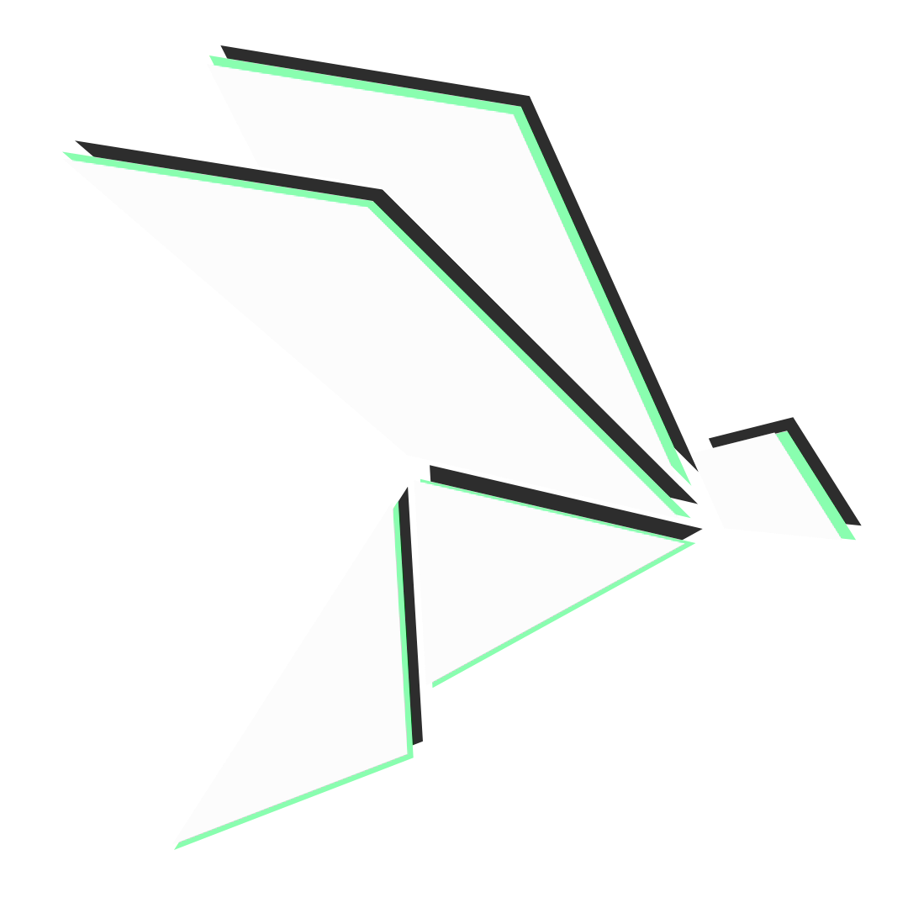

# Dyrane's Farm Cast



## Project Overview

Dyrane's Farm Cast is a web application designed to provide essential weather information and tailored agricultural recommendations to empower farmers and agriculture enthusiasts in making informed decisions. This MVP specification outlines the key components of the project.

## Technologies Used

- Frontend: Vite.js with React.js
- UI/UX : Tailwind css , Tremor
- Backend: Firebase
- Weather Data API: OpenWeatherMap
- Location Data API: Geodb Cities API
- Recommendations - OpenAI
- Hosting and Domain: Netlify and dr-dyrane.tech

## Project Details

### Architecture

The project architecture includes:

- Frontend: Vite.js with React.js for the user interface.
- Backend: Firebase for data storage and handling user authentication.
- External APIs: Integration with OpenWeatherMap and Geodb Cities API to retrieve weather and location data.
- Deployment: The application will be deployed on Netlify and will be accessible through the dr-dyrane.tech domain.

### API Endpoints

- `/api/weather`
  - GET: Returns weather data for a specified location and date.
  - POST: Allows users to report local weather conditions.
- `/api/recommendations`
  - GET: Provides agriculture-related recommendations based on weather data.

### Data Model

The data model includes the following collections:

- Users
- Locations
- Weather Reports
- Weather Forecasts
- Recommendations

## Key Features

- Real-time weather updates for your location.
- Personalized agricultural recommendations based on weather conditions.
- User-friendly interface for easy navigation.
- User registration and authentication.
- Seamless integration with OpenWeatherMap and Geodb Cities API.

## Getting Started

To run this project on your local machine, follow these steps:

1. Clone this repository.

2. Install project dependencies:

   ```bash
   npm install
   ```

3. Start the development server:

   ```bash
   npm run dev
   ```

4. Open your browser and access the application at [http://localhost:5173](http://localhost:5173).

## Deployment

The project is automatically deployed to Netlify. You can access the live application at [dfc.dr-dyrane.tech](https://dfc.dr-dyrane.tech).

## Contact

If you have any questions or suggestions, please feel free to [email us](mailto:halodyrane@gmail.com).

## Acknowledgments

This project was developed as part of the ALX Software Engineering program, Cohort 12.

## License

**MIT License**

```plaintext
MIT License

Copyright (c) 2023 Alexander Udeogaranya

Permission is hereby granted, free of charge, to any person obtaining a copy
of this software and associated documentation files (the "Software"), to deal
in the Software without restriction, including without limitation the rights
to use, copy, modify, merge, publish, distribute, sublicense, and/or sell
copies of the Software, and to permit persons to whom the Software is
furnished to do so, subject to the following conditions:

The above copyright notice and this permission notice shall be included in all
copies or substantial portions of the Software.

THE SOFTWARE IS PROVIDED "AS IS," WITHOUT WARRANTY OF ANY KIND, EXPRESS OR
IMPLIED, INCLUDING BUT NOT LIMITED TO THE WARRANTIES OF MERCHANTABILITY, FITNESS
FOR A PARTICULAR PURPOSE, AND NONINFRINGEMENT. IN NO EVENT SHALL THE AUTHORS OR
COPYRIGHT HOLDERS BE LIABLE FOR ANY CLAIM, DAMAGES, OR OTHER LIABILITY, WHETHER
IN AN ACTION OF CONTRACT, TORT, OR OTHERWISE, ARISING FROM, OUT OF, OR IN
CONNECTION WITH THE SOFTWARE OR THE USE, OR OTHER DEALINGS IN THE SOFTWARE.